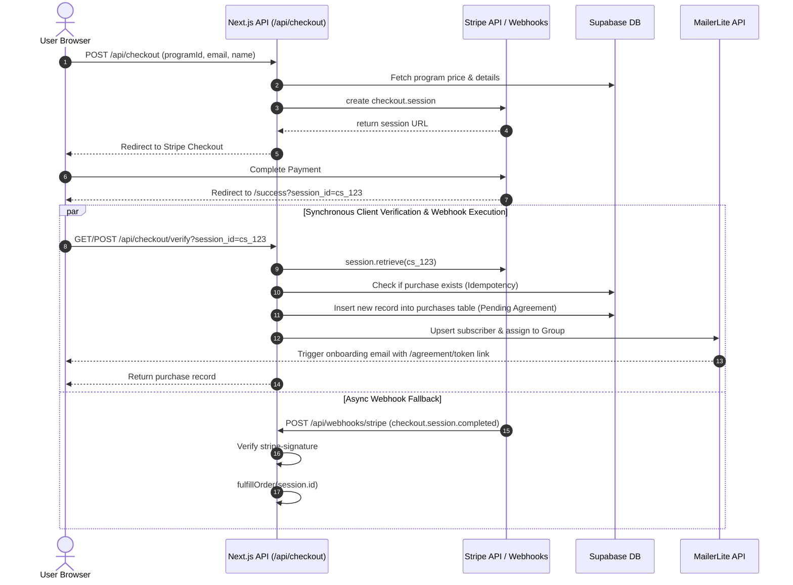

# 📡 SyncwellnessCo Backend API Documentation

> **Complete A-to-Z Reference Guide for API Routes, Backend Architecture, Authentication, Webhooks, and Integration Workflows.**

---

## 📌 1. Overview & Architecture

The **SyncwellnessCo** backend is built on top of **Next.js 16 App Router Route Handlers** (`/api/*`), interacting seamlessly with **Supabase (PostgreSQL)**, **Stripe**, **MailerLite**, **Calendly**, and **Cloudflare R2**.

### Base URL
* Local: `http://localhost:3000/api`
* Production: `https://www.syncwellnessco.com/api`

### Content Type & Encoding
* Standard requests and responses use `application/json; charset=utf-8`.
* Webhook endpoints (`/api/webhooks/stripe`, `/api/webhooks/calendly`) parse raw text payloads for cryptographic signature verification prior to JSON conversion.

### Global Error Format
All endpoints return standard HTTP status codes. In case of an error, response bodies follow this JSON format:
```json
{
  "error": "Descriptive error message here"
}
```

---

## 🔐 2. Authentication & Authorization Security

The API enforces three primary authorization strategies depending on the route target:

### 1. Admin Auth (Supabase Auth Session Cookies)
* **Used for:** Admin Dashboard endpoints (`/api/admin/*`, `POST/PUT/DELETE /api/programs`, `POST /api/videos`, `GET /api/purchases`, `GET /api/enquiries`, `GET /api/ebook-requests`, `GET /api/quiz-responses`, `POST /api/media/delete`, `POST /api/purchases/[id]/resend`).
* **Mechanism:** Checks the active user session via `@supabase/ssr` cookies (`await createClient()`). Verifies `session.user.user_metadata.role === 'admin'`.
* **Failure:** Returns `401 Unauthorized` if no active session exists or the user is not an admin.

### 2. Service API Key (`CONTENT_API_SECRET`)
* **Used for:** Blog mutations (`POST /api/blogs`, `PUT/DELETE /api/blogs/[slug]`).
* **Mechanism:** Verified via helper `verifyApiSecret(request)` in [`src/lib/api-auth.ts`](file:///home/prashant-singh/code/client/SyncwellnessCo/src/lib/api-auth.ts). Supports:
  * Header: `Authorization: Bearer <CONTENT_API_SECRET>`
  * Header: `x-api-key: <CONTENT_API_SECRET>`
* **Failure:** Returns `401 Unauthorized`.

### 3. Public & Token-Based Authorization
* **Public Form Submissions:** Contact form (`POST /api/enquiries`), E-book requests (`POST /api/ebook-requests`), Quiz responses (`POST /api/quiz-responses`), Checkout session creation (`POST /api/checkout`, `POST /api/payment-intent`).
* **Token Access:** Coaching Agreement acceptance (`PATCH /api/agreement/[token]`) relies on a 64-character cryptographically secure hex token generated during purchase fulfillment.

### 4. Webhook Cryptographic Signatures
* **Stripe Webhook (`/api/webhooks/stripe`):** Validated against `STRIPE_WEBHOOK_SECRET` using `stripe.webhooks.constructEvent(payload, sig, secret)`.
* **Calendly Webhook (`/api/webhooks/calendly`):** Validated against `CALENDLY_WEBHOOK_SIGNING_KEY` using HMAC SHA-256 (`Calendly-Webhook-Signature` header with timestamp replay tolerance check of 300 seconds).

---

## 📋 3. Complete API Endpoint Directory

| Category | Method | Endpoint | Access Level | Description |
| :--- | :--- | :--- | :--- | :--- |
| **Admin** | `GET` | `/api/admin/summary` | Admin Session | Aggregated metrics (revenue, enquiries, pending ebooks/reviews, recent activity) |
| **Programs** | `GET` | `/api/programs` | Public | List all wellness programs (supports `?published=true`) |
| | `POST` | `/api/programs` | Admin Session | Create a new program record with automatic slug generation |
| | `GET` | `/api/programs/[slug]` | Public | Fetch a single program by `slug` or `id` |
| | `PUT` / `PATCH` | `/api/programs/[slug]` | Admin Session | Update an existing program and revalidate paths |
| | `DELETE` | `/api/programs/[slug]` | Admin Session | Delete a program by `slug` or `id` |
| **Blogs** | `GET` | `/api/blogs` | Public | List all blog posts (supports `?published=true`) |
| | `POST` | `/api/blogs` | API Key | Create a new blog post |
| | `GET` | `/api/blogs/[slug]` | Public | Fetch a single blog post by `slug` or `id` |
| | `PUT` / `PATCH` | `/api/blogs/[slug]` | API Key | Update a blog post by `slug` or `id` |
| | `DELETE` | `/api/blogs/[slug]` | API Key | Delete a blog post by `slug` or `id` |
| **Checkout & Payments** | `POST` | `/api/checkout` | Public | Create a Stripe Checkout Session for a program |
| | `POST` / `GET` | `/api/checkout/verify` | Public | Idempotently fulfill order after Stripe payment completion |
| | `POST` | `/api/payment-intent` | Public | Create custom Stripe PaymentIntent for embedded card elements |
| | `GET` | `/api/purchases` | Admin Session | Fetch all customer purchase records |
| | `POST` | `/api/purchases/[id]/resend` | Admin Session | Resend coaching agreement link to customer via MailerLite |
| **Agreements** | `PATCH` | `/api/agreement/[token]` | Public (Token) | Accept coaching agreement (records IP, User-Agent & timestamp) |
| **Consultations** | `GET` | `/api/bookings` | Admin / Client | Fetch bookings by `invitee_uri`, `email`, or all (Admin) |
| | `POST` | `/api/bookings` | Public | Client-side fallback to log Calendly booking to Supabase |
| | `DELETE` | `/api/bookings/[id]` | Admin Session | Delete or cancel a booking record |
| | `GET` | `/api/bookings/status` | Public | Check consultation booking status by email and programId |
| **Leads & Contact** | `GET` | `/api/enquiries` | Admin Session | Fetch all contact form enquiries |
| | `POST` | `/api/enquiries` | Public | Submit contact form enquiry |
| | `DELETE` / `PATCH` | `/api/enquiries/[id]` | Admin Session | Delete enquiry or update enquiry status (`new`, `read`, `replied`) |
| | `GET` | `/api/ebook-requests` | Admin Session | Fetch all e-book download requests |
| | `POST` | `/api/ebook-requests` | Public | Request e-book download & trigger MailerLite automation |
| | `DELETE` | `/api/ebook-requests/[id]` | Admin Session | Delete an e-book request record |
| **Quiz Engine** | `GET` | `/api/quiz-responses` | Admin Session | Fetch all metabolic assessment quiz responses |
| | `POST` | `/api/quiz-responses` | Public | Submit quiz response with score and classification |
| **Social Proof & Media** | `GET` | `/api/reviews` | Public | Fetch written reviews (supports filtering & pagination) |
| | `POST` | `/api/reviews` | Public / Admin | Submit a new client review |
| | `DELETE` | `/api/reviews/[id]` | Admin Session | Delete a client review |
| | `GET` | `/api/videos` | Public | Fetch video testimonials |
| | `POST` | `/api/videos` | Admin Session | Create a new video testimonial entry |
| | `DELETE` | `/api/videos/[id]` | Admin Session | Delete a video testimonial entry |
| | `POST` | `/api/media/presign` | Admin / Review Submit | Generate presigned direct upload URL for Cloudflare R2 |
| | `POST` | `/api/media/delete` | Admin Session | Delete media asset from Cloudflare R2 bucket |
| **Webhooks** | `POST` | `/api/webhooks/stripe` | Stripe Webhook | Webhook handler for `checkout.session.completed` & `payment_intent.succeeded` |
| | `POST` | `/api/webhooks/calendly` | Calendly Webhook | Webhook handler for `invitee.created` & `invitee.canceled` |

---

## 🛠 4. In-Depth Endpoint Documentation

### 📊 Admin Summary API

#### `GET /api/admin/summary`
Retrieves aggregated metrics and recent activity for the Admin Dashboard.
* **Authentication:** Required (`admin` role session).
* **Response Body (200 OK):**
```json
{
  "counts": {
    "enquiries": 5,
    "ebooks": 12,
    "programs": 3,
    "reviews": 2,
    "revenue": 1497.00
  },
  "recent": {
    "purchases": [
      {
        "id": "uuid",
        "name": "Jane Doe",
        "program_id": "metabolic-reset",
        "amount": 59900,
        "createdAt": "2026-08-06T10:00:00.000Z"
      }
    ],
    "enquiries": [],
    "ebooks": []
  }
}
```

---

### 💳 Checkout & Order Fulfillment Flow

#### `POST /api/checkout`
Creates a Stripe Checkout Session for a program purchase.
* **Request Body:**
```json
{
  "programId": "metabolic-kickstarter",
  "email": "client@example.com",
  "name": "Jane Doe",
  "phone": "+61412345678",
  "userId": "optional-user-uuid"
}
```
* **Response Body (200 OK):**
```json
{
  "url": "https://checkout.stripe.com/c/pay/cs_test_a1b2c3..."
}
```

#### `POST /api/checkout/verify` & `GET /api/checkout/verify`
Idempotent payment verification and order fulfillment service called upon redirect to success page or via direct verification POST.
* **Query/Body Parameters:** `session_id` or `sessionId`
* **Response Body (200 OK):**
```json
{
  "success": true,
  "alreadyProcessed": false,
  "purchase": {
    "id": "purchase-uuid",
    "email": "client@example.com",
    "program_id": "metabolic-kickstarter",
    "amount": 59900,
    "currency": "aud",
    "status": "completed",
    "agreementToken": "64_char_hex_string",
    "agreementStatus": "Pending"
  }
}
```

#### Backend Actions Triggered During Order Fulfillment:
1. Checks for existing `stripe_session_id` in `purchases` table to guarantee **idempotency**.
2. Resolves `user_id` by looking up existing profiles/users by email.
3. Generates a secure `agreementToken` using `crypto.randomBytes(32).toString('hex')`.
4. Inserts purchase record into Supabase `purchases` table.
5. Updates user's `purchased_programs` text array in Supabase `profiles`/`users` table.
6. Syncs buyer email, name, and custom fields to **MailerLite**:
   * Field `purchased_program`: Program title
   * Field `agreement_url`: `https://www.syncwellnessco.com/agreement/<agreementToken>`
7. Assigns subscriber to `MAILERLITE_GROUP_PROGRAM_ENROLLMENT`, triggering the automated onboarding email sequence containing the Coaching Agreement link.

---

### ✍️ Coaching Agreement API

#### `PATCH /api/agreement/[token]`
Updates a purchase agreement status from `Pending` to `Accepted`.
* **URL Parameter:** `token` (64-character hex string)
* **Response Body (200 OK):**
```json
{
  "success": true
}
```
* **Database Updates:**
  * `agreementStatus`: `"Accepted"`
  * `agreementAcceptedAt`: Current ISO timestamp
  * `agreementIp`: Client IP (`x-forwarded-for` or `x-real-ip`)
  * `agreementUserAgent`: Client browser user agent

---

### 📩 E-Book Lead Generation API

#### `POST /api/ebook-requests`
Processes free e-book download requests and syncs leads to MailerLite.
* **Request Body:**
```json
{
  "email": "lead@example.com",
  "ebookName": "7-Day Metabolic Reset Guide",
  "name": "Sarah Jenkins",
  "phoneNumber": "412345678",
  "countryCode": "+61"
}
```
* **Response Body (201 Created):**
```json
{
  "success": true,
  "data": {
    "id": "uuid",
    "email": "lead@example.com",
    "ebookname": "7-Day Metabolic Reset Guide",
    "status": "sent"
  }
}
```
* **Backend Behavior:**
  * Checks for duplicate requests (`409 Conflict` if already requested).
  * Saves record to `ebook_requests` table.
  * Upserts subscriber to MailerLite and assigns to `MAILERLITE_GROUP_EBOOK` to trigger automated PDF delivery email.

---

### 📅 Consultation Bookings & Calendly Webhooks

#### `POST /api/webhooks/calendly`
Listens for real-time booking events from Calendly.
* **Headers Required:** `Calendly-Webhook-Signature: t=1690000000,v1=sha256_hash`
* **Event Handlers:**
  * `invitee.created` / `invitee_created`: Upserts record into `calendly_bookings` table with meeting name, start time, end time, timezone, and join URL. Calls Calendly v2 REST API to retrieve full event details if `CALENDLY_API_KEY` is present.
  * `invitee.canceled` / `invitee_canceled`: Removes booking record from `calendly_bookings` table.

#### `GET /api/bookings/status`
Checks if a user has completed a consultation call or has an active booking.
* **Query Parameters:** `email`, `programId` (optional)
* **Response Body (200 OK):**
```json
{
  "completed": false,
  "booking": {
    "id": "uuid",
    "event_name": "1:1 Discovery Call",
    "start_time": "2026-08-10T10:00:00Z",
    "join_url": "https://calendly.com/events/..."
  }
}
```

---

### 🗂 Cloudflare R2 Media Management APIs

#### `POST /api/media/presign`
Generates a presigned S3-compatible PUT URL for direct browser-to-R2 upload with progress tracking.
* **Authentication:** Required (`admin` role session, or public client for `folder: "reviews"` image submissions).
* **Request Body:**
```json
{
  "filename": "transformation-before.jpg",
  "contentType": "image/jpeg",
  "folder": "reviews"
}
```
* **Response Body (200 OK):**
```json
{
  "uploadUrl": "https://<account-id>.r2.cloudflarestorage.com/syncwellness-media/images/reviews/...",
  "publicUrl": "https://media.syncwellnessco.com/images/reviews/...",
  "key": "images/reviews/uuid-transformation-before.jpg"
}
```

#### `POST /api/media/delete`
Deletes an image or video object from Cloudflare R2 storage.
* **Authentication:** Required (`admin` role session).
* **Request Body:**
```json
{
  "key": "images/blogs/sample_image.webp"
}
```
* **Response Body (200 OK):**
```json
{
  "success": true,
  "key": "images/blogs/sample_image.webp"
}
```

---

## 🔄 5. Integration Workflow Diagrams

### Stripe Checkout & Order Fulfillment Lifecycle



---

## 🔐 6. Database Table Schemas

### `purchases`
* `id` (UUID, PK)
* `user_id` (UUID, FK to auth.users)
* `program_id` (TEXT, FK to programs.id)
* `amount` (INTEGER, amount in cents)
* `currency` (TEXT, default 'AUD')
* `status` (TEXT, default 'completed')
* `stripe_session_id` (TEXT, UNIQUE)
* `email` (TEXT)
* `name` (TEXT)
* `phone` (TEXT)
* `agreementToken` (TEXT, UNIQUE)
* `agreementStatus` (TEXT, 'Pending' | 'Accepted')
* `agreementAcceptedAt` (TIMESTAMP WITH TIME ZONE)
* `agreementIp` (TEXT)
* `agreementUserAgent` (TEXT)
* `created_at` (TIMESTAMP WITH TIME ZONE)

### `calendly_bookings`
* `id` (UUID, PK)
* `invitee_uri` (TEXT, UNIQUE)
* `event_uri` (TEXT)
* `event_name` (TEXT)
* `name` (TEXT)
* `email` (TEXT)
* `timezone` (TEXT)
* `start_time` (TIMESTAMP WITH TIME ZONE)
* `end_time` (TIMESTAMP WITH TIME ZONE)
* `join_url` (TEXT)
* `completed` (BOOLEAN, default FALSE)
* `created_at` (TIMESTAMP WITH TIME ZONE)

---

## ⚡ 7. Cache Invalidation & On-Demand Revalidation

To ensure zero latency between Admin Dashboard updates and public frontend pages, route handlers invoke `revalidatePath`:

```typescript
import { revalidatePath } from 'next/cache';

// Triggered upon Program modification
revalidatePath('/programs');
revalidatePath(`/programs/${slug}`);
revalidatePath('/', 'layout');

// Triggered upon Blog Post modification
revalidatePath('/resources/blogs');
revalidatePath(`/resources/blogs/${slug}`);
```

---
*Document updated for SyncwellnessCo platform release.*
